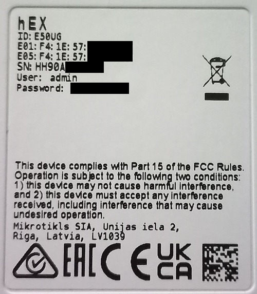
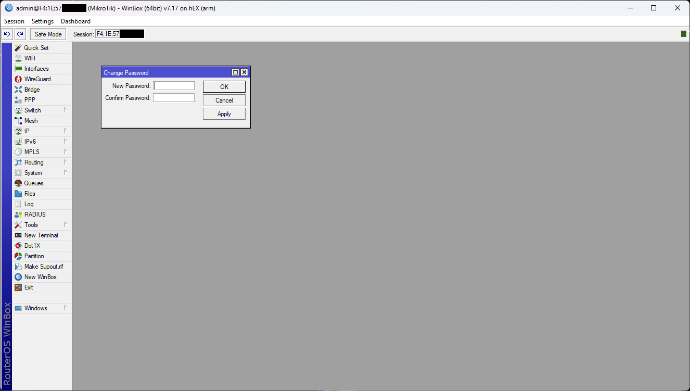

# Connecting to MT

### Default credentials

You can find default credentials, including the MAC address, on the MikroTik device label typically located at the bottom. Here's an example:

<div align="center"><figure><figcaption><p>Device Label</p></figcaption></figure></div>

***

### Using WinBox



### Download & Install WinBox



You can download [latest version](https://mikrotik.com/download) of WinBox from official website.


MikroTik Downloads




First things first you will need **snap package manager**, you can install it using:

```bash
sudo apt update
sudo apt install snapd
```

Then you can simply install WinBox using snap:

```bash
sudo snap install winbox
```

And you are ready to go



First things first you will need **Wine** which you can download and install from GitHub:



Then download [latest version](https://mikrotik.com/download) of WinBox from official website:


MikroTik Downloads


And launch W**inBox64.exe** using W**ine64.app**



Simply go to **Google Play Store** and search for **Mikrotik Pro**.


Google Play Store - MikroTik Pro








### Connect WinBox to MT

You can enter either your **IP** or **MAC address** with user and password manually or you can click on **Neighbors Tab** and find your MT and just enter user and password.

<figure><figcaption><p>WinBox Login</p></figcaption></figure>



### Start configuring

When you connect for the first time you will be prompt to change the password.

<figure><figcaption><p>WinBox Config</p></figcaption></figure>




***

## Using SSH/telnet
